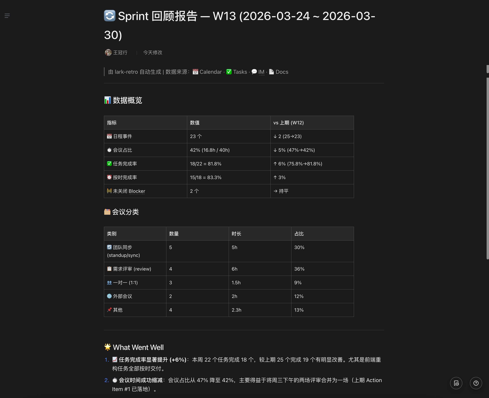

<p align="center">
  <h1 align="center">🔄 lark-retro</h1>
  <p align="center">
    <strong>基于飞书 CLI 的 AI 回顾工作流</strong><br>
    一句话触发周期回顾：自动读取日历、任务、消息、文档数据，生成结构化回顾报告，沉淀到知识库，创建行动项，闭环追踪。
  </p>
  <p align="center">
    
    
    
    
    
  </p>
  <p align="center">
    <a href="README_EN.md">English</a>
  </p>
</p>

---

## 😩 它解决什么问题

团队做回顾时，最常见的不是"没有会议"，而是"没有事实依据"：

- 🧠 **靠记忆回顾** — 容易只剩主观感受，说不出具体事例
- 🗂️ **数据散落各处** — 日历、任务、群聊、文档，很难拼起来看
- 🕳️ **行动项无人追踪** — 上次定的改进，下次已经没人记得
- ⏳ **会议效率低** — 1 小时会议，真正形成洞察的时间只有几分钟

## 📊 报告效果

<p align="center">
  
</p>

## 💬 一句话怎么用

```
帮我做一下上周的回顾
```

AI Agent 自动完成：

1. 📥 **数据采集** — 从日历、任务、消息、文档中拉取工作数据
2. 🔍 **模式分析** — 计算时间分配、任务完成率、识别 Blocker 和关键决策
3. 📝 **报告生成** — 输出结构化回顾（做得好的 / 待改进的 / 行动项 / 趋势对比）
4. 📄 **文档沉淀** — 创建飞书文档，可选归档到知识库
5. 🎯 **任务创建** — 行动项自动创建飞书任务（经用户确认）
6. 🔁 **闭环追踪** — 下次回顾时自动检查上期行动项是否落地

## 🏗️ 架构

```mermaid
flowchart LR
    User["🗣️ 用户：帮我做一下上周的回顾"] --> Collect

    subgraph Collect["📥 数据采集层"]
        direction TB
        C1["calendar +agenda\n时间分配"]
        C2["task +get-my-tasks\n任务完成率"]
        C3["im +messages-search\nBlocker & 决策"]
        C4["docs +search\n上期回顾"]
    end

    Collect --> Analyze

    subgraph Analyze["🔍 AI 分析层"]
        direction TB
        A1["会议分类"]
        A2["完成率 & 趋势"]
        A3["提取 Blocker"]
        A4["对比上期"]
    end

    Analyze --> Output

    subgraph Output["📤 输出层"]
        direction TB
        O1["docs +create\n回顾文档"]
        O2["wiki-space\n知识库归档"]
        O3["task +create\n行动项任务"]
        O4["messages-send\n群聊通知"]
    end

    Output --> Loop["🔁 闭环：下次回顾自动追踪上期行动项"]
    Loop -.->|"下个周期"| User
```



## ⚡ 有什么不同

| 维度 | 现有官方 Skill | lark-retro |
|------|---------------|------------|
| 🎯 **范围** | 单一领域操作（发消息、查日历） | 跨 5 个领域编排 |
| 🧠 **智能度** | 执行命令 | 分析数据、发现规律、生成洞察 |
| 🔗 **连续性** | 单次操作 | 跨周期闭环追踪 |
| 📦 **输出** | 原始数据或简单摘要 | 结构化报告 + 文档归档 + 任务创建 + 通知 |

## 🧩 能力分层

| 层级 | 功能 | 所需授权 |
|------|------|---------| 
| 🟢 基础版 | 日历分析 + 文档输出 | `--domain calendar,docs` |
| 🔵 增强版 | + 任务追踪 | `--domain calendar,task,docs` |
| 🟣 高级版 | + 消息搜索 + 知识库归档 | + `--scope "search:message search:docs:read"` |
| 🟠 完整版 | + Bot 群聊通知 | + 开发者后台开通 bot 能力 |

每个模块独立运作——缺少某个授权时自动跳过，不影响其他功能。

## 📦 安装

### 一键安装（推荐）

```bash
curl -fsSL https://raw.githubusercontent.com/gkzzhs/lark-retro/master/setup.sh | bash
```

或克隆后本地运行：

```bash
git clone https://github.com/gkzzhs/lark-retro.git && bash lark-retro/setup.sh
```

### 手动安装

<details>
<summary>展开手动安装步骤</summary>

#### 前置要求

- Node.js >= 18
- [lark-cli](https://github.com/larksuite/cli) 已安装

#### 安装步骤

```bash
# 1. 安装 lark-cli（如尚未安装）
npm install -g @larksuite/cli

# 2. 安装官方 Skills（包含 lark-shared 等基础依赖，必须先装）
npx skills add https://github.com/larksuite/cli -y -g

# 3. 安装 lark-retro
npx skills add https://github.com/gkzzhs/lark-retro -y -g

# 4. 配置并登录
lark-cli config init --new

# 推荐授权（日历 + 任务 + 文档）
lark-cli auth login --domain calendar,task,docs

# 可选：启用消息搜索和文档搜索
lark-cli auth login --scope "search:message search:docs:read"

# 5. 重启你的 AI Agent 工具（Trae / Cursor / Claude Code / Codex）
```

> ⚠️ 第 2 步必须先于第 3 步执行。`lark-retro` 依赖官方 `lark-shared` Skill。
>
> ⚠️ domain 必须用 `docs`（带 s），`doc` 会被 CLI 拒绝。

</details>

## 🚀 使用示例

### 基础回顾（日历 + 任务）

```
帮我做一下上周的回顾
```

### 完整回顾（含消息分析）

```
帮我复盘一下过去两周的工作，包括群聊里的关键讨论
```

### 回顾 + 知识库归档

```
生成这个 Sprint 的回顾报告，存到知识库的"团队回顾"节点下
```

### 追踪上期行动项

```
上周回顾里的行动项完成了吗？顺便做一下这周的回顾
```

### 工作周报生成

```
帮我写这周的周报，基于日历和任务数据
```

## 📋 示例输出

<<<<<<< HEAD
完整的回顾报告示例见 [examples/sample-output.md](examples/sample-output.md)。
=======


See [examples/sample-output.md](examples/sample-output.md) for a complete sample retro report.
>>>>>>> 4ed4902 (docs: update sample report screenshot with higher quality image)

## ⚙️ 配置说明

首次使用需完成 `lark-cli` 配置与授权（见安装步骤）。知识库归档、群聊通知等进阶用法见 [examples/config-guide.md](examples/config-guide.md)。

## ✅ 已验证的能力

以下链路已通过真实飞书账号端到端验证：

- ✅ `calendar +agenda` — 读取真实日程数据（实测返回 43 条日程）
- ✅ `task +get-my-tasks` / `task +create` — 任务读取与创建
- ✅ `docs +create` — 独立文档 / `--wiki-space my_library` / `--wiki-node`（三选一）
- ✅ `docs +search` / `im +messages-search` — 文档和消息搜索（`docs +search` 结果受标题命名与索引时机影响，新建文档可能需数分钟后才可搜到）
- ✅ `im +messages-send --as bot` — Bot 消息发送与撤回
- ✅ 完整闭环：数据采集 → 报告生成 → 文档创建 → 任务创建 → 通知发送

## 🛠️ 技术特点

- 🚫 **零代码，纯 Skill** — 完全通过 `SKILL.md` 实现，无脚本、无二进制文件、无外部依赖
- 🔧 **100% lark-cli 原生** — 所有操作使用内置命令
- 📈 **渐进增强** — 核心功能（日历+文档）只需最少权限；任务、消息、知识库、通知按需开启

## 🤝 贡献

欢迎提交 Issue 和 Pull Request！

## 📄 许可证

[MIT](LICENSE)

---

为 [飞书 CLI 创作者大赛 2026](https://bytedance.larkoffice.com/docx/HWgKdWfeSoDw36xu7EYctBrUnsg) 而作，基于 [lark-cli](https://github.com/larksuite/cli) 构建。
