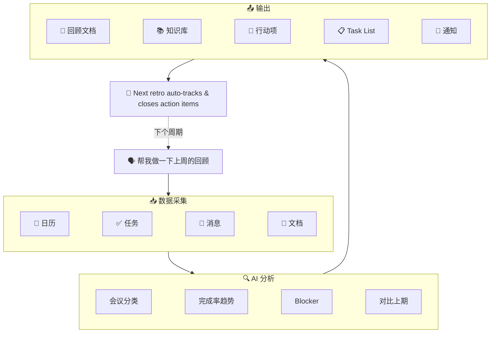

<p align="center">
  <h1 align="center">🔄 lark-retro</h1>
  <p align="center">
    <strong>基于飞书 CLI 的 AI 回顾 & 周报工作流</strong><br>
    一句话触发周期回顾或工作周报：自动读取日历、任务、消息、文档数据，生成结构化 Sprint Retro / 周报 / 工作复盘，并可沉淀到知识库、创建行动项、发送通知。支持行动项自动关闭、任务列表分组、历史报告对比。
  </p>
  <p align="center">
    
    
    
    
    
  </p>
  <p align="center">
    <a href="README_EN.md">English</a>
  </p>
  <p align="center">
    <code>v2.2.0</code> 新增：会议纪要分析 · Wiki 节点精准管理 · 精确搜索过滤 — 全面适配 lark-cli v1.0.7
  </p>
</p>

---

## 😩 它解决什么问题

每到周五下午，你是不是也有过这种感觉 —— 这周到底干了啥？

打开日历翻一翻，再去任务列表看一眼，群聊里搜半天关键字…… 30 分钟过去了，回顾还没开始写。好不容易写完了，上周说好的行动项呢？谁还记得？

一天三四个会的人，光整理纪要和回顾就够喝一壶了。

所以我做了 lark-retro：**一句话下去，日历（含会议纪要）、任务、消息、文档全部自动拉取，AI 生成结构化报告，行动项自动创建和追踪。** 上期承诺没兑现的？下次回顾自动帮你揪出来。

## 🎬 Demo

<p align="center">
  
</p>

## ⏱️ 效率对比

| | 手动回顾 | lark-retro |
|---|:---:|:---:|
| **数据收集** | 翻日历、翻任务、翻群聊，30-60 min | 自动采集 5 个数据源（含妙记），30 秒 |
| **报告撰写** | 整理排版写报告，30-60 min | AI 生成结构化报告，1 分钟 |
| **上期追踪** | 找上期文档、逐条核对，经常遗漏 | 自动精确搜索上期报告、逐条追踪 |
| **格式统一** | 每次重新排版 | 回顾 / 周报双模板，一键切换 |
| **总耗时** | **1-2 小时** | **< 3 分钟** |

## 📊 报告效果

<p align="center">
  
</p>

## 🆕 v2.2 亮点（适配 lark-cli v1.0.7）

- **会议纪要分析 (v1.0.7)** — 自动拉取并分析日历日程关联的妙记内容，获取深度洞察
- **Wiki 节点精准管理 (v1.0.7)** — 使用 `wiki +node-create` 直接在知识库创建节点，自动处理权限
- **精确搜索过滤 (v1.0.7)** — 利用新增的 `--filter` 条件精准匹配历史报告标题，排除杂项噪声
- **自动编辑权限 (v1.0.7)** — 应用创建的文档会自动授予你编辑权限，无需手动设置
- **`@file` 本地文件引用** — `docs +create --markdown @report.md`，长报告无需 shell 转义
- **`docs +update`** — 对已有文档增量追加/覆盖更新，支持按标题或内容定位
- **`task +complete` / `+comment` / `+tasklist-*`** — 行动项自动关闭、备注、任务列表分组，跨周期闭环

## 💬 一句话怎么用

```
帮我做一下上周的回顾
```

AI Agent 自动完成：

1. 📥 **数据采集** — 从日历、任务、消息、文档中拉取工作数据
2. 🔍 **模式分析** — 计算时间分配、任务完成率、识别 Blocker 和关键决策
3. 📝 **报告生成** — 输出结构化回顾（做得好的 / 待改进的 / 行动项 / 趋势对比）
4. 📄 **文档沉淀** — 创建飞书文档，可选归档到知识库
5. 🎯 **任务创建** — 行动项自动创建飞书任务（经用户确认）
6. 🔁 **闭环追踪** — 下次回顾时自动检查上期行动项是否落地

## 🏗️ 架构



## ⚡ 有什么不同

| 维度 | 现有官方 Skill | lark-retro |
|------|---------------|------------|
| 🎯 **范围** | 单一领域操作（发消息、查日历） | 跨 5 个领域编排 |
| 🧠 **智能度** | 执行命令 | 分析数据、发现规律、生成洞察 |
| 🔗 **连续性** | 单次操作 | 跨周期闭环：自动追踪 + task +complete 关闭行动项 |
| 📦 **输出** | 原始数据或简单摘要 | 结构化报告 + 文档归档 + 任务创建 + 通知 |

## 🧩 能力分层

| 层级 | 功能 | 所需授权 |
|------|------|---------| 
| 🟢 基础版 | 日历分析 + 文档输出 | `--domain calendar,docs` |
| 🔵 增强版 | + 任务追踪 + 行动项关闭 | `--domain calendar,task,docs` |
| 🟣 高级版 | + 消息搜索 + 知识库归档 | + `--scope "search:message search:docs:read"` |
| 🟠 完整版 | + Bot 群聊通知 + 历史报告导出 | + 开发者后台开通 bot 能力 |

每个模块独立运作——缺少某个授权时自动跳过，不影响其他功能。

## 📦 安装

### 一键安装（推荐）

```bash
curl -fsSL https://raw.githubusercontent.com/gkzzhs/lark-retro/master/setup.sh | bash
```

或克隆后本地运行：

```bash
git clone https://github.com/gkzzhs/lark-retro.git && bash lark-retro/setup.sh
```

### 手动安装

<details>
<summary>展开手动安装步骤</summary>

#### 前置要求

- Node.js >= 18
- [lark-cli](https://github.com/larksuite/cli) 已安装

#### 安装步骤

```bash
# 1. 安装 lark-cli（如尚未安装）
npm install -g @larksuite/cli

# 2. 安装官方 Skills（包含 lark-shared 等基础依赖，必须先装）
npx skills add https://github.com/larksuite/cli -y -g

# 3. 安装 lark-retro
npx skills add https://github.com/gkzzhs/lark-retro -y -g

# 4. 配置并登录
lark-cli config init --new

# 推荐授权（日历 + 任务 + 文档）
lark-cli auth login --domain calendar,task,docs

# 可选：启用消息搜索和文档搜索
lark-cli auth login --scope "search:message search:docs:read"

# 可选：启用历史报告导出（用于 drive +export 趋势对比）
lark-cli auth login --scope "docs:document.content:read"

# 可选：启用以用户身份发消息（用于 im +messages-send --as user）
lark-cli auth login --scope "im:message.send_as_user im:message"

# 5. 重启你的 AI Agent 工具（Trae / Cursor / Claude Code / Codex）
```

> ⚠️ 第 2 步必须先于第 3 步执行。`lark-retro` 依赖官方 `lark-shared` Skill。
>
> ⚠️ domain 必须用 `docs`（带 s），`doc` 会被 CLI 拒绝。

</details>

## 🚀 使用示例

### 基础回顾（日历 + 任务）

```
帮我做一下上周的回顾
```

### 完整回顾（含消息分析）

```
帮我复盘一下过去两周的工作，包括群聊里的关键讨论
```

### 回顾 + 知识库归档

```
生成这个 Sprint 的回顾报告，存到知识库的"团队回顾"节点下
```

### 追踪上期行动项

```
上周回顾里的行动项完成了吗？顺便做一下这周的回顾
```

### 关闭上期行动项

```
帮我关掉上次回顾的行动项，然后做这周的回顾
```

### 工作周报生成

```
帮我写这周的周报，基于日历和任务数据
```

```
帮我写一下本周工作汇报，顺便列一下下周计划
```

## 📋 示例输出


完整的回顾报告示例见 [examples/sample-output.md](examples/sample-output.md)。

## ⚙️ 配置说明

首次使用需完成 `lark-cli` 配置与授权（见安装步骤）。知识库归档、群聊通知等进阶用法见 [examples/config-guide.md](examples/config-guide.md)。

## ✅ 已验证的能力

> 当前公开版（v2.2.0）已在真实飞书账号 + lark-cli v1.0.7 上完成 E2E 回归测试。
> 覆盖范围：读日历、获取会议纪要、搜消息、列群聊消息、精确文档搜索、建文档（含 @file 引用）、更新文档、Wiki 节点创建、建任务、关闭任务、评论任务、建任务列表、bot 发消息。

### 完整 E2E 验证（读写链路全部跑通）

- ✅ `calendar +agenda` / `minutes minutes get` — 读取真实日程及会议纪要数据 (v1.0.7)
- ✅ `docs +search --filter` — 基于精确匹配过滤定位文档 (v1.0.7)
- ✅ `wiki +node-create` — 在知识库中创建新节点并自动授权 (v1.0.7)
- ✅ `task +get-my-tasks` / `task +create` — 任务读取与创建
- ✅ `task +complete` / `task +comment` — 行动项关闭与备注
- ✅ `task +tasklist-create` / `task +tasklist-task-add` — 任务列表分组管理
- ✅ `docs +create` — 独立文档 / `--wiki-space my_library` / `--wiki-node`（三选一）
- ✅ `docs +create --markdown @file` — 本地文件引用创建文档 (v1.0.5)
- ✅ `docs +update --mode append` — 已有文档增量追加 (v1.0.5)
- ✅ `docs +search` / `im +messages-search` — 文档和消息搜索
- ✅ `im +messages-send --as bot` — Bot 消息发送与撤回
- ✅ `im +chat-messages-list` — 群聊消息列表（按时间范围，更少噪声）
- ✅ `--jq` 实时过滤 — 对任意命令 JSON 输出进行字段过滤
- ✅ 完整闭环：数据采集 → 报告生成 → 文档创建 → 任务创建 → 通知发送

### 命令验证 + 权限边界验证（命令真实存在，权限边界正确，需额外 scope 授权后跑通）

- ⚠️ `drive +export` — 文档导出为 Markdown（需 `lark-cli auth login --scope "docs:document.content:read"`）
- ⚠️ `im +messages-send --as user` — 以用户身份发消息（需 `lark-cli auth login --scope "im:message.send_as_user im:message"`）

## 🛠️ 技术特点

- 🚫 **零代码，纯 Skill** — 完全通过 `SKILL.md` 实现，无脚本、无二进制文件、无外部依赖
- 📄 **本地文件引用** — `@file` 模式避免 shell 转义，`docs +update` 增量更新已有文档
- 🔧 **100% lark-cli 原生** — 所有操作使用内置命令
- 📈 **渐进增强** — 核心功能（日历+文档）只需最少权限；任务、消息、知识库、通知按需开启
- 🔁 **闭环行动项追踪** — 上期行动项自动关闭（task +complete）、备注（task +comment）、任务列表分组管理

## 📖 开发故事

想知道为什么选择纯 SKILL.md 而不是写脚本？消息噪声是怎么过滤的？行动项闭环是怎么一步步演进到 v2.0 的？

👉 [开发踩坑记录：lark-retro 是怎么做出来的](docs/dev-story.md)

## 🧪 测试记录

所有 CLI 命令均在真实飞书账号上实测，覆盖正常流程、边界情况和权限降级。

👉 [完整测试记录](docs/test-results.md)

## 🤝 贡献

欢迎提交 Issue 和 Pull Request！

## ⭐ 支持项目

如果 lark-retro 对你有帮助，请给个 Star ⭐ 让更多人看到！

[](https://star-history.com/#gkzzhs/lark-retro&Date)

## 📄 许可证

[MIT](LICENSE)

---

为 [飞书 CLI 创作者大赛 2026](https://bytedance.larkoffice.com/docx/HWgKdWfeSoDw36xu7EYctBrUnsg) 而作，基于 [lark-cli](https://github.com/larksuite/cli) 构建。
