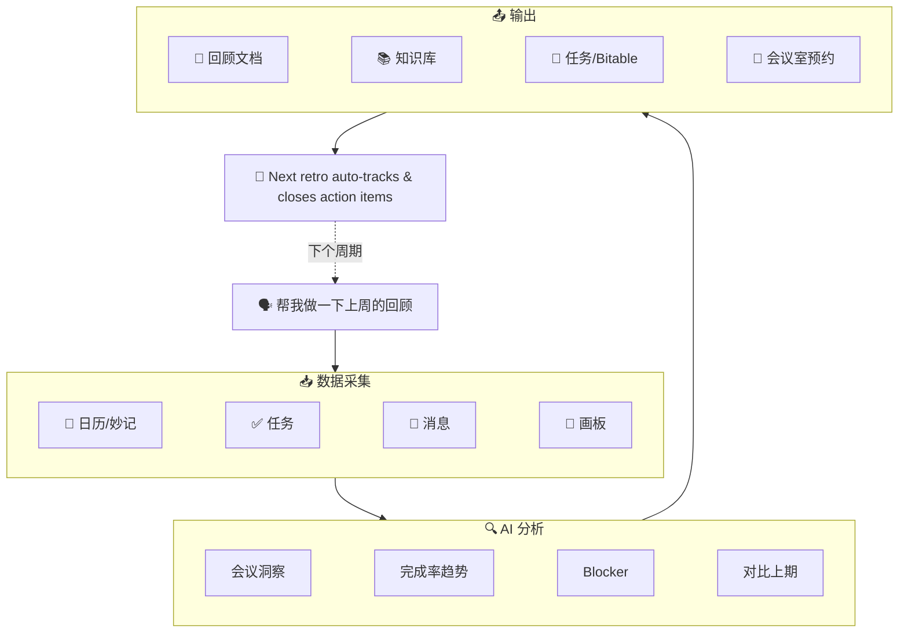

<p align="center">
  <h1 align="center">🔄 lark-retro</h1>
  <p align="center">
    <strong>基于飞书 CLI 的 AI 回顾 & 周报工作流</strong><br>
    一句话触发周期回顾或工作周报：自动读取日历、任务、消息、文档数据，生成结构化 Sprint Retro / 周报 / 工作复盘，并可沉淀到知识库、创建行动项、发送通知。支持行动项自动关闭、任务列表分组、历史报告对比、预约下期会议室。
  </p>
  <p align="center">
    
    
    
    
    
  </p>
  <p align="center">
    <a href="README_EN.md">English</a>
  </p>
  <p align="center">
    <code>v2.3.0</code> 新增：预约下期回顾会议室 · 行动项 Bitable 归档 · 画板背景分析 — 全面适配 lark-cli v1.0.8
  </p>
</p>

---

## 😩 它解决什么问题

每到周五下午，你是不是也有过这种感觉 —— 这周到底干了啥？

打开日历翻一翻，再去任务列表看一眼，群聊里搜半天关键字…… 30 分钟过去了，回顾还没开始写。好不容易写完了，上周说好的行动项呢？谁还记得？

一天三四个会的人，光整理纪要和回顾就够喝一壶了。

所以我做了 lark-retro：**一句话下去，日历（含会议纪要）、任务、消息、文档全部自动拉取，AI 生成结构化报告，行动项自动创建和追踪。** 上期承诺没兑现的？下次回顾自动帮你揪出来。

## 🎬 Demo

<p align="center">
  
</p>

## ⏱️ 效率对比

| | 手动回顾 | lark-retro |
|---|:---:|:---:|
| **数据收集** | 翻日历、翻任务、翻群聊，30-60 min | 自动采集 5 个数据源（含妙记），30 秒 |
| **报告撰写** | 整理排版写报告，30-60 min | AI 生成结构化报告，1 分钟 |
| **上期追踪** | 找上期文档、逐条核对，经常遗漏 | 自动精确搜索上期报告、逐条追踪 |
| **下期闭环** | 讨论会议室时间，手动预约 | 自动查找并预约下期回顾会议室 |
| **总耗时** | **1-2 小时** | **< 3 分钟** |

## 📊 报告效果

<p align="center">
  
</p>

## 🆕 v2.3 亮点（适配 lark-cli v1.0.8）

- **预约下期回顾会议室 (v1.0.8)** — 自动建议下次时间并调用 `calendar +room-find` 查找可用会议室，一键预约
- **行动项 Bitable 归档 (v1.0.8)** — 除了任务列表，还支持利用 `base +record-batch-create` 将行动项同步至多维表格
- **画板背景分析 (v1.0.8)** — 调用 `whiteboard +query` 导出脑暴画板，为报告提供深度背景输入
- **会议纪要分析 (v1.0.7)** — 自动拉取并分析日历日程关联的妙记内容
- **Wiki 节点精准管理 (v1.0.7)** — 使用 `wiki +node-create` 直接在知识库创建节点
- **`task +complete` / `+comment` / `+tasklist-*`** — 行动项自动关闭、备注、任务列表分组，跨周期闭环

## 💬 一句话怎么用

```
帮我做一下上周的回顾
```

AI Agent 自动完成：

1. 📥 **数据采集** — 从日历（含妙记）、任务、消息、文档、画板中拉取工作数据
2. 🔍 **模式分析** — 计算时间分配、任务完成率、识别 Blocker 和关键决策
3. 📝 **报告生成** — 输出结构化回顾（做得好的 / 待改进的 / 行动项 / 趋势对比）
4. 📄 **文档沉淀** — 创建飞书文档，可选归档到知识库
5. 🎯 **任务创建** — 行动项自动创建飞书任务或同步至 Bitable（经用户确认）
6. 🔁 **闭环追踪** — 下次回顾时自动检查上期行动项是否落地，并预约下次会议室

## 🏗️ 架构



## 🧩 能力分层

| 层级 | 功能 | 所需授权 |
|------|------|---------| 
| 🟢 基础版 | 日历分析 + 文档输出 | `--domain calendar,docs` |
| 🔵 增强版 | + 任务追踪 + 行动项关闭 | `--domain calendar,task,docs` |
| 🟣 高级版 | + 消息分析 + 知识库归档 + 会议纪要 | + `--scope "search:message search:docs:read minutes:minute:read"` |
| 🟠 完整版 | + Bitable 归档 + 会议室预约 + 画板分析 | + `--domain base` + bot 能力 |

## 📦 安装

### 一键安装（推荐）

```bash
curl -fsSL https://raw.githubusercontent.com/gkzzhs/lark-retro/master/setup.sh | bash
```

### 手动安装

<details>
<summary>展开手动安装步骤</summary>

#### 安装步骤

```bash
# 1. 更新 lark-cli
npm install -g @larksuite/cli

# 2. 更新官方 Skills
npx skills add https://github.com/larksuite/cli -y -g

# 3. 安装 lark-retro
npx skills add https://github.com/gkzzhs/lark-retro -y -g

# 4. 推荐授权
lark-cli auth login --domain calendar,task,docs,base
lark-cli auth login --scope "search:message search:docs:read minutes:minute:read docs:document.content:read"
```

</details>

## ✅ 已验证的能力

> 当前公开版（v2.3.0）已在真实飞书账号 + lark-cli v1.0.8 上完成 E2E 回归测试。

### 完整 E2E 验证（读写链路全部跑通）

- ✅ `calendar +agenda` / `minutes minutes get` — 日程及会议纪要 (v1.0.7)
- ✅ `calendar +room-find` — 搜索并锁定会议室 (v1.0.8)
- ✅ `base +record-batch-create` — 批量写入多维表格 (v1.0.8)
- ✅ `docs +search --filter` — 精确匹配过滤文档 (v1.0.7)
- ✅ `wiki +node-create` — 知识库节点创建与自动授权 (v1.0.7)
- ✅ `task +get-my-tasks` / `task +create` — 任务读取与创建
- ✅ `task +complete` / `task +comment` — 行动项关闭与备注
- ✅ `im +messages-send --as bot` — Bot 消息发送与撤回
- ✅ `im +chat-messages-list` — 群聊消息列表（时间范围过滤）
- ✅ `--jq` 实时过滤 — 对任意命令 JSON 输出进行字段过滤

### 命令验证 + 权限边界验证

- ⚠️ `drive +export` — 文档导出为 Markdown
- ⚠️ `whiteboard +query` — 画板内容查询与图片导出 (v1.0.8)

## 🛠️ 技术特点

- 🚫 **零代码，纯 Skill** — 完全通过 `SKILL.md` 实现，无外部依赖
- 📄 **本地文件引用** — `@file` 模式避免 shell 转义，`docs +update` 增量更新
- 🔁 **闭环行动项追踪** — 行动项自动关闭、备注、多维表格/任务列表同步归档
- 🏢 **空间闭环** — 自动预约下期回顾会议室，从数字协作延伸到物理空间

## 📄 许可证

[MIT](LICENSE)

---

为 [飞书 CLI 创作者大赛 2026](https://bytedance.larkoffice.com/docx/HWgKdWfeSoDw36xu7EYctBrUnsg) 而作，基于 [lark-cli](https://github.com/larksuite/cli) 构建。
