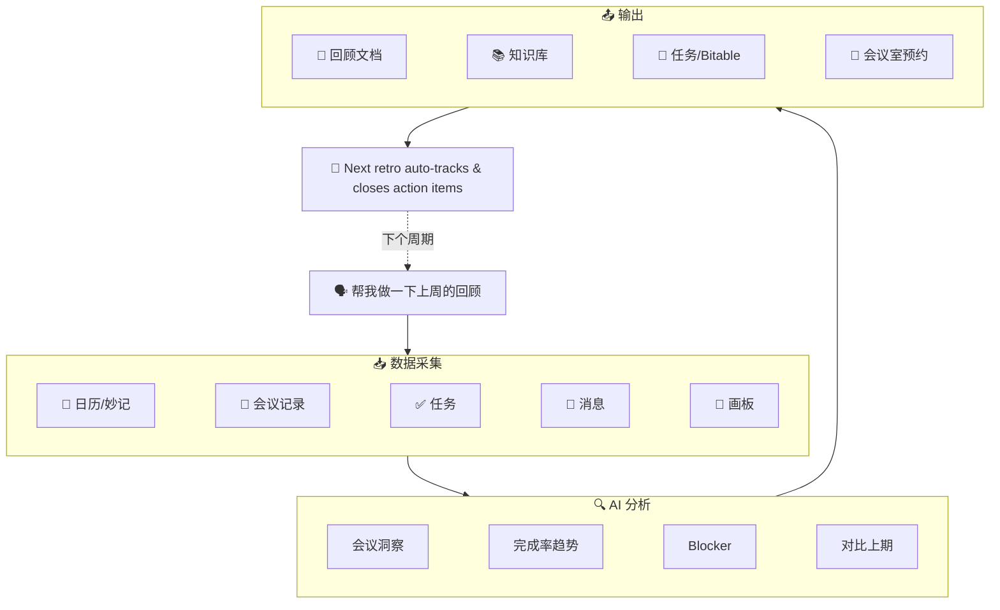

<p align="center">
  <h1 align="center">🔄 lark-retro</h1>
  <p align="center">
    <strong>基于飞书 CLI 的 AI 回顾 & 周报工作流</strong><br>
    一句话触发周期回顾或工作周报：自动读取日历、会议纪要/会议记录、任务、消息、文档数据，生成结构化 Sprint Retro / 周报 / 工作复盘，并可沉淀到知识库、创建行动项、发送通知。支持行动项自动关闭、任务列表分组、历史报告对比、预约下期会议室。
  </p>
  <p align="center">
    
    
    
    
    
  </p>
  <p align="center">
    <a href="README_EN.md">English</a>
  </p>
  <p align="center">
    <code>v2.6.2</code> 新增：Emoji 输出门槛 · Hermes Agent 安装说明 · OKR 对齐分析 · Wiki 知识空间初始化 — 适配 lark-cli v1.0.14
  </p>
</p>

---

## 😩 它解决什么问题

每到周五下午，你是不是也有过这种感觉 —— 这周到底干了啥？

打开日历翻一翻，再去任务列表看一眼，群聊里搜半天关键字…… 30 分钟过去了，回顾还没开始写。好不容易写完了，上周说好的行动项呢？谁还记得？

一天三四个会的人，光整理纪要和回顾就够喝一壶了。

所以我做了 lark-retro：**一句话下去，日历（含会议纪要/会议记录）、任务、消息、文档全部自动拉取，AI 生成结构化报告，行动项自动创建和追踪。** 上期承诺没兑现的？下次回顾自动帮你揪出来。

## 🎬 Demo

<p align="center">
  
</p>

## 🧭 Before / After

Before：

- 数据散在日历、妙记、任务、群聊和历史文档里，回顾前先人工翻半小时。
- 报告容易变成“感觉这周很忙”，缺少会议、任务和 Blocker 证据。
- 上期行动项靠记忆追踪，跨周期很容易断。
- 想补会议录制内容时，还要再去会议记录里手动搜。

After：

- 一句话触发，自动把日历、会议记录、任务、消息、文档、画板拼成证据链。
- 报告默认带数据质量说明：哪些数据采到了、哪些因为权限或无结果降级。
- 行动项可以创建任务、备注、关闭，也可以同步到 Bitable，所有写入前都先确认。
- 下一次回顾会继续追踪上期承诺，并可提前查找下期会议室。

## ⏱️ 效率对比

| | 手动回顾 | lark-retro |
|---|:---:|:---:|
| **数据收集** | 翻日历、翻任务、翻群聊，30-60 min | 自动采集 6 个数据源（含妙记/会议记录），30 秒 |
| **报告撰写** | 整理排版写报告，30-60 min | AI 生成结构化报告，1 分钟 |
| **上期追踪** | 找上期文档、逐条核对，经常遗漏 | 自动精确搜索上期报告、逐条追踪 |
| **下期闭环** | 讨论会议室时间，手动预约 | 自动查找并预约下期回顾会议室 |
| **总耗时** | **1-2 小时** | **< 3 分钟** |

## 📊 报告效果

<p align="center">
  
</p>

## 🆕 v2.6 亮点（适配 lark-cli v1.0.14）

- **OKR 对齐分析 (v1.0.14)** — 可选读取 `okr +cycle-list` / `okr +cycle-detail`，把本周期会议、任务、Blocker 和目标/KR 做对齐分析；缺少 OKR 权限时自动降级
- **Wiki 知识空间初始化 (v1.0.14)** — `wiki spaces create` 支持一键创建团队回顾知识空间，适合首次部署或比赛演示；真实创建前必须确认空间名称和分享状态
- **报告附件展示方式 (v1.0.14)** — `docs +media-insert --file-view card|preview|inline` 可把导出的 PDF、录屏或附件以卡片、预览播放器或内嵌形式插入报告
- **报告文件夹自动创建 (v1.0.13)** — `drive +create-folder` 可先创建项目/周期报告文件夹，再放入报告快捷方式，减少用户手工准备 folder token 的成本
- **用户身份富媒体通知 (v1.0.13)** — `im +messages-send --as user --file/--image/--audio/--video` 可用本人身份发送报告附件；文件路径必须是当前目录内相对路径，默认仍推荐 bot Markdown 通知
- **任务清单自定义分组 (v1.0.10)** — `task +tasklist-task-add --section-guid` 支持把行动项直接放入用户指定分组，并显式检查 `failed_tasks`，避免 `ok: true` 但实际分组失败
- **报告快捷方式归档 (v1.0.10)** — `drive +create-shortcut` 可把回顾报告入口放到指定团队文件夹，适合评审资料夹、项目资料夹等场景
- **云文档标题修正 (v1.0.10)** — `drive files patch` 可在报告生成后统一修正文档标题，适合先生成再按团队命名规范归档
- **Wiki 成员只读预检 (v1.0.10)** — `wiki members list` 可检查目标知识库成员可见性；添加/删除成员属于高风险管理动作，默认不执行
- **会议录制搜索 (v1.0.9)** — 调用 `vc +search` 按时间范围、关键词、参与人等条件搜索会议录制，补齐日历没有返回 `minute_token` 的会议上下文
- **会议记录补强 (v1.0.9)** — 对相关会议调用 `vc +notes` 获取 `note_doc_token` / `verbatim_doc_token`，让回顾报告能引用更具体的结论、待办和争议点
- **预约下期回顾会议室 (v1.0.8)** — 自动建议下次时间并调用 `calendar +room-find` 查找可用会议室，确认后预约
- **行动项 Bitable 归档 (v1.0.8)** — 除了任务列表，还支持利用 `base +record-batch-create` 将行动项同步至多维表格
- **画板背景分析 (v1.0.8)** — 调用 `whiteboard +query` 导出脑暴画板，为报告提供深度背景输入
- **会议纪要分析 (v1.0.7)** — 自动拉取并分析日历日程关联的妙记内容
- **Wiki 节点精准管理 (v1.0.7)** — 使用 `wiki +node-create` 直接在知识库创建节点
- **`task +complete` / `+comment` / `+tasklist-*`** — 行动项自动关闭、备注、任务列表分组，跨周期闭环

## 💬 一句话怎么用

```
帮我做一下上周的回顾
```

AI Agent 自动完成：

1. 📥 **数据采集** — 从日历（含妙记/会议记录）、任务、消息、文档、画板中拉取工作数据
2. 🔍 **模式分析** — 计算时间分配、任务完成率、识别 Blocker 和关键决策
3. 📝 **报告生成** — 输出结构化回顾（做得好的 / 待改进的 / 行动项 / 趋势对比）
4. 📄 **文档沉淀** — 创建飞书文档，可选归档到知识库
5. 🎯 **任务创建** — 行动项自动创建飞书任务或同步至 Bitable（经用户确认）
6. 🔁 **闭环追踪** — 下次回顾时自动检查上期行动项是否落地，并预约下次会议室

## 🏗️ 架构



## 🧩 能力分层

| 层级 | 功能 | 所需授权 |
|------|------|---------| 
| 🟢 基础版 | 日历分析 + 文档输出 | `--domain calendar,docs` |
| 🔵 增强版 | + 任务追踪 + 行动项关闭 | `--domain calendar,task,docs` |
| 🟣 高级版 | + 消息分析 + 知识库归档 + 会议纪要/会议记录 + OKR 对齐 | + `--scope "search:message search:docs:read minutes:minute:read vc:record:readonly okr:okr.period:readonly okr:okr.content:readonly"` |
| 🟠 完整版 | + Bitable 归档 + 会议室预约 + 画板分析 + 报告空间自动初始化 | + `--domain base` + bot 能力 + `space:folder:create wiki:space:write_only` |

## 📦 安装

### 一键安装（推荐）

```bash
curl -fsSL https://raw.githubusercontent.com/gkzzhs/lark-retro/master/setup.sh | bash
```

### 手动安装

<details>
<summary>展开手动安装步骤</summary>

#### 安装步骤

```bash
# 1. 安装或更新 lark-cli
npx @larksuite/cli install
# 已安装过 lark-cli 的用户也可以直接运行：lark-cli update

# 2. 更新官方 Skills
npx skills add https://github.com/larksuite/cli -y -g

# 3. 安装 lark-retro
npx skills add https://github.com/gkzzhs/lark-retro -y -g

# 4. 推荐授权
lark-cli auth login --domain calendar,task,docs,base
lark-cli auth login --scope "search:message search:docs:read minutes:minute:read vc:record:readonly docs:document.content:read"
lark-cli auth login --scope "space:document:shortcut space:document:retrieve space:folder:create docx:document:write_only wiki:member:retrieve"
lark-cli auth login --scope "okr:okr.period:readonly okr:okr.content:readonly wiki:space:write_only im:message im:message.send_as_user"
```

</details>

## 🪽 Hermes Agent 支持

`lark-retro` 使用标准 `SKILL.md` 结构，和 Hermes Agent 的 Skills 系统兼容。推荐把 Hermes 的 external skill directory 指向仓库里的 `skills` 目录，而不是仓库根目录：

```yaml
skills:
  external_dirs:
    - /path/to/lark-retro/skills
```

配置后，Hermes 应能扫描到 `lark-retro` 这个 skill。仓库仍保留 `npx skills add` 的默认安装方式，方便 Codex / Cursor / Claude Code / Trae 等工具继续使用。

## ✅ 已验证的能力

> 当前公开版（v2.6.2）已在真实飞书账号 + lark-cli v1.0.14 上完成分层回归测试；需要外部真实资源的能力按命令/权限/参数边界单独标注。

### 完整 E2E 验证（读写链路全部跑通）

- ✅ `calendar +agenda` / `minutes minutes get` — 日程及会议纪要 (v1.0.7)
- ✅ `vc +search` / `vc +notes` / `docs +fetch` — 会议录制搜索、会议记录 token 获取与正文读取 (v1.0.9)
- ✅ `docs +search --filter` — 精确匹配过滤文档 (v1.0.7)
- ✅ `wiki +node-create` — 知识库节点创建与自动授权 (v1.0.7)
- ✅ `task +get-my-tasks` / `task +create` — 任务读取与创建
- ✅ `task +complete` / `task +comment` — 行动项关闭与备注
- ✅ `task +tasklist-task-add` — 行动项添加到任务清单；`--section-guid` 参数与 `failed_tasks` 失败边界已验证 (v1.0.10)
- ✅ `drive files patch` — 云文档标题修正 (v1.0.10)
- ✅ `drive +create-shortcut` / `drive files list` / `drive +delete` — 报告快捷方式创建、验证与清理 (v1.0.10)
- ✅ `wiki members list` — 知识库成员只读预检 (v1.0.10)
- ✅ `im +messages-send --as bot` — Bot 消息发送与撤回
- ✅ `im +chat-messages-list` — 群聊消息列表（时间范围过滤）
- ✅ `--jq` 实时过滤 — 对任意命令 JSON 输出进行字段过滤

### 命令验证 + 权限/参数边界验证

- ⚠️ `calendar +room-find` — 会议室候选查询命令与参数结构已验证；真实预订需用户确认后通过日程创建链路完成 (v1.0.8)
- ⚠️ `task +tasklist-task-add --section-guid` — 命令与失败边界已验证；真实分组写入需用户提供已有 `section_guid` (v1.0.10)
- ⚠️ `base +record-batch-create` — 批量写入命令与参数结构已验证；真实写入需提供目标 `base_token` / `table_id` (v1.0.8)
- ⚠️ `drive +export` — 文档导出为 Markdown 的命令已验证；真实导出需要可读文档和导出权限
- ⚠️ `drive +create-folder` — 报告文件夹创建 dry-run 已验证；可省略 `--folder-token` 落到根目录，真实创建前需确认目标位置 (v1.0.13)
- ⚠️ `whiteboard +query` — 画板内容查询与图片导出命令已验证；真实分析需要有效的 `whiteboard_token` (v1.0.8)
- ⚠️ `wiki members create/delete` — 命令、scope 与 dry-run 已验证；真实增删会改变知识库成员，默认不纳入回顾主流程 (v1.0.10)
- ⚠️ `okr +cycle-list` / `okr +cycle-detail` — 命令与缺权限边界已验证；真实 OKR 读取需 `okr:okr.period:readonly` / `okr:okr.content:readonly` (v1.0.14)
- ⚠️ `wiki spaces create` — dry-run 请求结构已验证；真实创建会新增知识空间，必须由用户确认名称、描述与 `open_sharing` (v1.0.14)
- ⚠️ `docs +media-insert --file-view preview` — 文件展示方式 dry-run 已验证；真实插入需要有效文档和本地相对路径附件 (v1.0.14)

## 🔒 安全与边界

- **默认先读后写**：采集日历、任务、消息、文档、会议记录用于分析；创建文档、任务、Bitable 记录、群通知、会议室预约前都必须让用户确认。
- **不保存凭证**：飞书认证交给 `lark-cli`，Skill 不保存 access token，也不要求用户粘贴密钥。
- **会议记录谨慎处理**：`vc +notes` / `docs +fetch` 读取到的会议记录只作为报告输入；测试记录只写 `has_content` 等状态，不粘贴会议正文。
- **权限不足可降级**：缺少 `search:message`、`vc:record:readonly`、`docs:document.content:read` 等 scope 时，跳过对应模块并在报告中标注，不中断主流程。
- **知识库成员管理默认只读**：v1.0.10 的 `wiki members create/delete` 不会静默执行；lark-retro 默认只使用 `wiki members list` 做成员可见性预检。
- **OKR 只做只读增强**：v1.0.14 的 OKR 数据只用于目标/KR 对齐分析，不自动修改 OKR。
- **知识空间创建必须确认**：`wiki spaces create` 会真实新增空间，默认只做 dry-run 或在用户明确确认后执行。
- **附件插入和富媒体通知必须确认**：`docs +media-insert` 与 `im +messages-send --as user --file/--image/...` 都会上传本地文件，执行前必须展示文件路径、接收人和用途。
- **外发动作显式确认**：`im +messages-send`、`base +record-batch-create`、`calendar +room-find` 后续预约链路都不会静默执行。

## 🛠️ 技术特点

- 🚫 **零代码，纯 Skill** — 完全通过 `SKILL.md` 实现，无外部依赖
- 📄 **本地文件引用** — `@file` 模式避免 shell 转义，`docs +update` 增量更新
- 🔁 **闭环行动项追踪** — 行动项自动关闭、备注、多维表格/任务列表同步归档
- 🏢 **空间闭环** — 自动预约下期回顾会议室，从数字协作延伸到物理空间

## 📄 许可证

[MIT](LICENSE)

---

为 [飞书 CLI 创作者大赛 2026](https://bytedance.larkoffice.com/docx/HWgKdWfeSoDw36xu7EYctBrUnsg) 而作，基于 [lark-cli](https://github.com/larksuite/cli) 构建。
