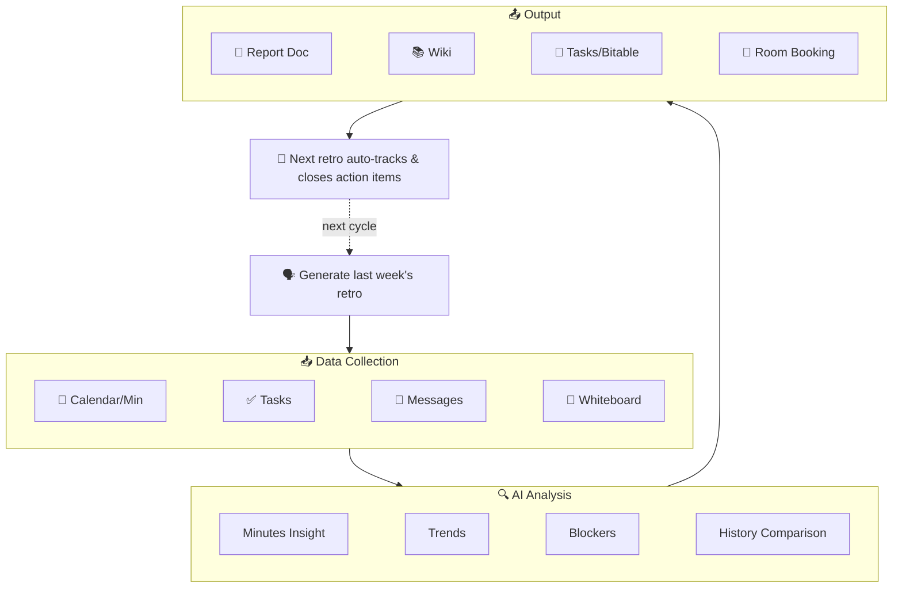

  <h1 align="center">🔄 lark-retro</h1>
  

    <strong>AI-Driven Sprint Retro & Weekly Report for Feishu/Lark</strong> 
    One sentence triggers a retro or weekly report: auto-collect from Calendar, Tasks, Messages, Docs, Whiteboards — generate structured reports, archive to Wiki, create tasks, and <strong>pre-book the next meeting room</strong>.
  

  

    
    
    
    
  

  

    <a href="README.md">中文文档</a>
  

  

    <code>v2.3.0</code>: Next Retro Room Booking · Bitable Action Items · Whiteboard Context — fully adapted for lark-cli v1.0.8
  

---

## 😩 The Problem

Every Friday afternoon, the same question hits you — what did I actually do this week?

You open the calendar, scroll through tasks, search keywords in group chats… 30 minutes later, you haven't even started writing the retro. And those action items from last sprint? Who even remembers?

That's why I built lark-retro: **one sentence, and it automatically pulls data, generates a report, and tracks action items. It even books your next meeting room.**

## 🎬 Demo

  

## 🆕 v2.3 Highlights (Adapting lark-cli v1.0.8)

- **Book Next Retro Room (v1.0.8)** — Suggests next time slot and uses `calendar +room-find` to find available rooms automatically.
- **Archive Action Items to Bitable (v1.0.8)** — Support syncing items to Bitable tables via `base +record-batch-create`.
- **Whiteboard Context Analysis (v1.0.8)** — Use `whiteboard +query` to export brainstorm boards as background input for the report.
- **Meeting Minutes Analysis (v1.0.7)** — Automatically analyze linked Feishu Minutes for deeper meeting insights.

## 🏗️ Architecture

## ✅ Verified Capabilities

> v2.3.0 was regression-tested on a real Feishu account with lark-cli v1.0.8. Capabilities that require external live resources are marked separately as command/permission/parameter boundary checks.

### Full E2E Verified

- ✅ `calendar +agenda` / `minutes minutes get` — Calendar & Minutes (v1.0.7)
- ✅ `docs +search --filter` — Precise doc search (v1.0.7)
- ✅ `wiki +node-create` — Wiki node management (v1.0.7)
- ✅ `task +get-my-tasks` / `task +create` — Tasks
- ✅ `task +complete` / `task +comment` — Task closure/notes
- ✅ `im +messages-send --as bot` — Bot messages
- ✅ `im +chat-messages-list` — Group message history

### Command Verified + Permission/Parameter Boundary Verified

- ⚠️ `calendar +room-find` — Room candidate lookup command and parameter shape verified; actual booking requires user confirmation and the calendar creation flow. (v1.0.8)
- ⚠️ `base +record-batch-create` — Batch write command and payload shape verified; real writes require a target `base_token` / `table_id`. (v1.0.8)
- ⚠️ `drive +export` — Document export to Markdown command verified; real export requires readable source documents and export permissions.
- ⚠️ `whiteboard +query` — Whiteboard raw/image query command verified; real analysis requires a valid `whiteboard_token`. (v1.0.8)

## 🛠️ Technical Features

- 🚫 **Zero Code, Pure Skill** — 100% `SKILL.md`, no external dependencies.
- 🏢 **Space Loop** — Closes the loop from digital tasks to physical meeting room booking.
- 🔁 **Continuous Retro** — Auto-closes previous items and bridges to the next cycle.

## 📄 License

[MIT](LICENSE)
