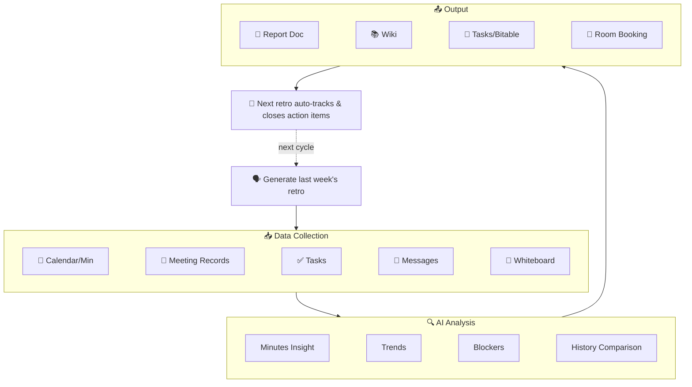

<p align="center">
  <h1 align="center">🔄 lark-retro</h1>
  <p align="center">
    <strong>AI-Driven Sprint Retro & Weekly Report for Feishu/Lark</strong><br>
    One sentence triggers a retro or weekly report: auto-collect from Calendar, Meeting Minutes/Records, Tasks, Messages, Docs, and Whiteboards — generate structured reports, archive to Wiki, create tasks, and <strong>pre-book the next meeting room</strong>.
  </p>
  <p align="center">
    
    
    
    
  </p>
  <p align="center">
    <a href="README.md">中文文档</a>
  </p>
  <p align="center">
    <code>v2.6.3</code>: Real Emoji write verification · global Skill version check · Hermes Agent setup notes — adapted for lark-cli v1.0.14
  </p>
</p>

---

## 😩 The Problem

Every Friday afternoon, the same question hits you — what did I actually do this week?

You open the calendar, scroll through tasks, search keywords in group chats… 30 minutes later, you haven't even started writing the retro. And those action items from last sprint? Who even remembers?

That's why I built lark-retro: **one sentence, and it automatically pulls data, generates a report, and tracks action items. It even books your next meeting room.**

## 🎬 Demo

<p align="center">
  
</p>

## 🧭 Before / After

Before:

- Work evidence is scattered across Calendar, Minutes, Tasks, chats, and historical docs, so every retro starts with manual archaeology.
- Reports easily become "it felt busy this week" without concrete meeting, task, or blocker evidence.
- Previous action items are tracked from memory, and cross-cycle follow-through gets lost.
- Meeting recordings require a separate manual search when calendar events do not expose minutes directly.

After:

- One sentence triggers a data-backed chain across Calendar, Meeting Records, Tasks, Messages, Docs, and Whiteboards.
- Reports include data quality notes: what was collected, what was missing, and what degraded because of permissions or empty results.
- Action items can be created, commented, closed, or archived to Bitable, with user confirmation before every write.
- The next retro can continue tracking previous commitments and check candidate rooms for the next session.

## 🆕 v2.6 Highlights (Adapting lark-cli v1.0.14)

- **OKR Alignment (v1.0.14)** — Optionally read `okr +cycle-list` / `okr +cycle-detail` to compare meetings, tasks, blockers, and outcomes against objectives and key results; missing OKR scopes degrade gracefully.
- **Wiki Space Bootstrap (v1.0.14)** — Use `wiki spaces create` to initialize a team retro knowledge space for first-time setup or contest demos; real creation requires explicit confirmation of name and sharing mode.
- **Report Media Embedding (v1.0.14)** — Use `docs +media-insert --file-view card|preview|inline` to attach exported PDFs, recordings, or supporting files as cards, preview players, or inline blocks.
- **Report Folder Auto-create (v1.0.13)** — Use `drive +create-folder` before creating shortcuts so users do not need to prepare a folder token manually.
- **User-identity Rich Media Notifications (v1.0.13)** — Use `im +messages-send --as user --file/--image/--audio/--video` to send report attachments from the user's own account; paths must be relative to the current directory, and bot Markdown remains the default.
- **Tasklist Custom Sections (v1.0.10)** — Use `task +tasklist-task-add --section-guid` to place action items into a specific tasklist section, while explicitly checking `failed_tasks` so `ok: true` does not hide a failed section add.
- **Report Shortcuts (v1.0.10)** — Use `drive +create-shortcut` to place a report entry in a team/project folder after the report doc is generated.
- **Drive Title Patching (v1.0.10)** — Use `drive files patch` to align report titles with team naming conventions after creation.
- **Wiki Member Read-only Preflight (v1.0.10)** — Use `wiki members list` to inspect target wiki visibility; member add/remove remains a high-risk admin action and is not part of the default retro flow.
- **Meeting Recording Search (v1.0.9)** — Use `vc +search` to find meeting recordings by time range, keyword, participant, or room, filling gaps when calendar events do not expose a `minute_token`.
- **Meeting Notes Enrichment (v1.0.9)** — Use `vc +notes` to retrieve `note_doc_token` / `verbatim_doc_token` for relevant meetings, so the retro can cite concrete decisions, follow-ups, and open questions.
- **Book Next Retro Room (v1.0.8)** — Suggests next time slot and uses `calendar +room-find` to find available rooms before user-confirmed booking.
- **Archive Action Items to Bitable (v1.0.8)** — Support syncing items to Bitable tables via `base +record-batch-create`.
- **Whiteboard Context Analysis (v1.0.8)** — Use `whiteboard +query` to export brainstorm boards as background input for the report.
- **Meeting Minutes Analysis (v1.0.7)** — Automatically analyze linked Feishu Minutes for deeper meeting insights.

## 🏗️ Architecture



## 🪽 Hermes Agent Support

`lark-retro` uses the standard `SKILL.md` layout and is compatible with the Hermes Agent Skills system. For the most reliable setup, point Hermes' external skill directory at this repository's `skills` folder rather than the repository root:

```yaml
skills:
  external_dirs:
    - /path/to/lark-retro/skills
```

After that, Hermes should discover the `lark-retro` skill. The repository still keeps the default `npx skills add` installation path for Codex, Cursor, Claude Code, Trae, and similar agent tools.

## ✅ Verified Capabilities

> v2.6.3 was regression-tested on a real Feishu account with lark-cli v1.0.14. Capabilities that require external live resources are marked separately as command/permission/parameter boundary checks.

### Full E2E Verified

- ✅ `calendar +agenda` / `minutes minutes get` — Calendar & Minutes (v1.0.7)
- ✅ `vc +search` / `vc +notes` / `docs +fetch` — Meeting recording search, meeting-note token retrieval, and note body fetch (v1.0.9)
- ✅ `docs +search --filter` — Precise doc search (v1.0.7)
- ✅ `wiki +node-create` — Wiki node management (v1.0.7)
- ✅ `task +get-my-tasks` / `task +create` — Tasks
- ✅ `task +complete` / `task +comment` — Task closure/notes
- ✅ `task +tasklist-task-add` — Add action items to a tasklist; the `--section-guid` parameter and `failed_tasks` failure boundary were verified. (v1.0.10)
- ✅ `drive files patch` — Drive doc title patching. (v1.0.10)
- ✅ `drive +create-shortcut` / `drive files list` / `drive +delete` — Report shortcut creation, verification, and cleanup. (v1.0.10)
- ✅ `wiki members list` — Wiki member read-only preflight. (v1.0.10)
- ✅ `im +messages-send --as bot` — Bot messages
- ✅ `im +chat-messages-list` — Group message history

### Command Verified + Permission/Parameter Boundary Verified

- ⚠️ `calendar +room-find` — Room candidate lookup command and parameter shape verified; actual booking requires user confirmation and the calendar creation flow. (v1.0.8)
- ⚠️ `task +tasklist-task-add --section-guid` — Command and failure boundary verified; real custom-section writes require an existing user-provided `section_guid`. (v1.0.10)
- ⚠️ `base +record-batch-create` — Batch write command and payload shape verified; real writes require a target `base_token` / `table_id`. (v1.0.8)
- ⚠️ `drive +export` — Document export to Markdown command verified; real export requires readable source documents and export permissions.
- ⚠️ `drive +create-folder` — Report folder creation dry-run verified; omitting `--folder-token` falls back to the caller's root folder, and real creation requires target-location confirmation. (v1.0.13)
- ⚠️ `whiteboard +query` — Whiteboard raw/image query command verified; real analysis requires a valid `whiteboard_token`. (v1.0.8)
- ⚠️ `wiki members create/delete` — Command, scope, and dry-run verified; real member changes affect wiki access and are intentionally outside the default retro flow. (v1.0.10)
- ⚠️ `okr +cycle-list` / `okr +cycle-detail` — Command shape and missing-scope boundary verified; real OKR reads require `okr:okr.period:readonly` / `okr:okr.content:readonly`. (v1.0.14)
- ⚠️ `wiki spaces create` — Dry-run request shape verified; real creation adds a new wiki space and requires explicit confirmation. (v1.0.14)
- ⚠️ `docs +media-insert --file-view preview` — Media view dry-run verified; real insertion requires a valid doc and a local relative-path attachment. (v1.0.14)

## 🔒 Safety Boundaries

- **Read first, write only after confirmation** — lark-retro collects Calendar, Task, Message, Doc, and Meeting Record data for analysis; creating docs, tasks, Bitable records, group notifications, or room bookings requires user confirmation.
- **No credential storage** — Feishu/Lark auth stays in `lark-cli`; the Skill does not store access tokens or ask users to paste secrets.
- **Careful meeting-record handling** — content from `vc +notes` / `docs +fetch` is used as report input; test logs only record status such as `has_content`, not meeting body text.
- **Graceful permission fallback** — missing scopes such as `search:message`, `vc:record:readonly`, or `docs:document.content:read` skip only the affected module and are called out in the report.
- **Wiki member management stays read-only by default** — v1.0.10 `wiki members create/delete` is never executed silently; lark-retro only uses `wiki members list` as a visibility preflight unless the user explicitly asks for admin changes.
- **OKR is read-only enrichment** — v1.0.14 OKR data is used only for alignment analysis; lark-retro never modifies objectives or key results.
- **Wiki space creation requires confirmation** — `wiki spaces create` creates real spaces, so lark-retro only dry-runs or executes after explicit user confirmation.
- **Media uploads require confirmation** — `docs +media-insert` and `im +messages-send --as user --file/--image/...` upload local files, so the file path, recipient, and purpose must be shown first.
- **No silent external actions** — `im +messages-send`, `base +record-batch-create`, and the room-booking flow after `calendar +room-find` are never executed silently.

## 🛠️ Technical Features

- 🚫 **Zero Code, Pure Skill** — 100% `SKILL.md`, no external dependencies.
- 🏢 **Space Loop** — Closes the loop from digital tasks to physical meeting room booking.
- 🔁 **Continuous Retro** — Auto-closes previous items and bridges to the next cycle.

## 📄 License

[MIT](LICENSE)
