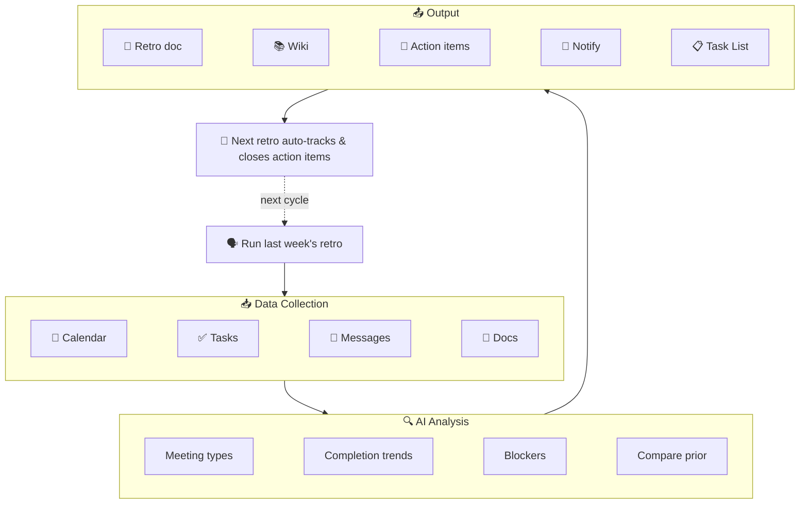

<p align="center">
  <h1 align="center">🔄 lark-retro</h1>
  <p align="center">
    <strong>AI-Driven Sprint Retro & Weekly Report for Feishu/Lark</strong><br>
    One sentence triggers a retro or weekly report: auto-collect from Calendar, Tasks, Messages, Docs — generate structured Sprint Retro / Weekly Report / Work Summary, archive to Wiki, create action items, and **auto-close previous action items**.
  </p>
  <p align="center">
    
    
    
    
  </p>
  <p align="center">
    <a href="README.md">中文文档</a>
  </p>
  <p align="center">
    <code>v2.2.0</code>: Meeting Minutes Analysis · Precise Wiki Node Management · Advanced Search Filters — fully adapted for lark-cli v1.0.7
  </p>
</p>

---

## 😩 The Problem

Every Friday afternoon, the same question hits you — what did I actually do this week?

You open the calendar, scroll through tasks, search keywords in group chats… 30 minutes later, you haven't even started writing the retro. And those action items from last sprint? Who even remembers?

If you have 3-4 meetings a day, just organizing notes and retros is already a full-time job.

That's why I built lark-retro: **one sentence, and it automatically pulls Calendar (including meeting minutes), Tasks, Messages, and Docs data, generates a structured report with AI, and creates & tracks action items.** Commitments from last sprint that nobody followed up on? The next retro catches them automatically.

## 🎬 Demo

<p align="center">
  
</p>

## ⏱️ Efficiency Comparison

| | Manual Retro | lark-retro |
|---|:---:|:---:|
| **Data collection** | Browse calendar, tasks, chats: 30-60 min | Auto-collect from 5 sources: 30 sec |
| **Report writing** | Organize, format, write: 30-60 min | AI-generated structured report: 1 min |
| **Previous tracking** | Find last report, check items one by one | Auto-search & track each item |
| **Format consistency** | Re-format every time | Retro / Weekly dual templates |
| **Total time** | **1-2 hours** | **< 3 minutes** |

## 📊 Sample Report

<p align="center">
  
</p>

## 💬 The Solution

`lark-retro` turns retrospectives from a meeting into a **data-driven automated workflow**:

```
You: "帮我做一下上周的回顾"        ← Sprint retro
You: "帮我写这周的周报"             ← Weekly report
You: "帮我关掉上次的行动项"         ← Close action items
```

The AI Agent automatically:

1. 📥 **Collects** work data from 4+ Feishu domains (Calendar, Tasks, Messages, Docs)
2. 🔍 **Analyzes** patterns: time allocation, task completion rate, blockers, key decisions
3. 📝 **Generates** a structured report — **Retro mode** (What Went Well / Improved / Action Items) or **Weekly Report mode** (Done / Plan / Support Needed)
4. 📄 **Archives** the report as a Feishu Doc and links it to your Wiki knowledge space
5. 🎯 **Creates** Tasks for each Action Item with assignees and due dates, grouped in a **Task List**
6. 🔁 **Tracks** previous Action Items — next retro automatically checks what got done
7. ✅ **Closes** completed Action Items via `task +complete` with confirmation notes

## 🏗️ Architecture



## ⚡ What Makes This Different

| Dimension | Existing Skills | lark-retro |
|-----------|----------------|------------|
| 🎯 **Scope** | Single domain (send message, check calendar) | Cross-domain orchestration (5 domains) |
| 🧠 **Intelligence** | Execute commands | Analyze data, find patterns, generate insights |
| 🔗 **Continuity** | One-shot operation | Closed-loop tracking + auto-close via task +complete |
| 📦 **Output** | Raw data or simple summary | Structured report + archived doc + tasks + notification |

## 🧩 Capability Tiers

| Tier | Features | Authorization |
|------|----------|---------------|
| 🟢 Basic | Calendar analysis + doc output | `--domain calendar,docs` |
| 🔵 Enhanced | + Task tracking + action item closure | `--domain calendar,task,docs` |
| 🟣 Advanced | + Message search + doc search + wiki archival | + `--scope "search:message search:docs:read"` |
| 🟠 Full | + Bot team notification + history report export | + Bot enabled in developer console |

Each module works independently — missing authorization for one tier simply skips that module without affecting others.

## 📦 Installation

### One-Click Install (Recommended)

```bash
curl -fsSL https://raw.githubusercontent.com/gkzzhs/lark-retro/master/setup.sh | bash
```

Or clone and run locally:

```bash
git clone https://github.com/gkzzhs/lark-retro.git && bash lark-retro/setup.sh
```

### Manual Install

<details>
<summary>Expand manual installation steps</summary>

#### Prerequisites

- Node.js >= 18
- [lark-cli](https://github.com/larksuite/cli) installed and configured

#### Steps

```bash
# 1. Install lark-cli (if not already installed)
npm install -g @larksuite/cli

# 2. Install official skills (includes lark-shared — MUST install before lark-retro)
npx skills add https://github.com/larksuite/cli -y -g

# 3. Install lark-retro skill
npx skills add https://github.com/gkzzhs/lark-retro -y -g

# 4. Configure and login
lark-cli config init --new

# Recommended: calendar + tasks + docs
lark-cli auth login --domain calendar,task,docs

# Optional: enable message search and doc search
lark-cli auth login --scope "search:message search:docs:read"

# Optional: enable history report export (for drive +export trend comparison)
lark-cli auth login --scope "docs:document.content:read"

# Optional: enable sending messages as user (for im +messages-send --as user)
lark-cli auth login --scope "im:message.send_as_user im:message"

# 5. Restart your AI Agent tool (Trae / Cursor / Claude Code / Codex)
```

> ⚠️ Step 2 must be done before Step 3. `lark-retro` depends on the official `lark-shared` skill.
>
> ⚠️ Use `docs` (with 's'), not `doc`. The CLI rejects `doc` as an unknown domain.

</details>

## 🚀 Usage Examples

### Basic Retro (Calendar + Tasks only)

```
帮我做一下上周的回顾
```

### Full Retro with Message Analysis

```
帮我复盘一下过去两周的工作，包括群聊里的关键讨论
```

### Retro with Knowledge Archival

```
生成这个 Sprint 的回顾报告，存到知识库的"团队回顾"节点下
```

### Track Previous Action Items

```
上周回顾里的行动项完成了吗？顺便做一下这周的回顾
```

### Close Previous Action Items

```
帮我关掉上次回顾的行动项，然后做这周的回顾
```

### Generate Work Summary (Weekly Report)

```
帮我写这周的周报，基于日历和任务数据
```

## 📋 Sample Output

See [examples/sample-output.md](examples/sample-output.md) for a complete sample retro report.

## 🆕 v2.2 Highlights (Adapting lark-cli v1.0.7)

- **Meeting Minutes Analysis (v1.0.7)** — Automatically fetch and analyze Feishu Minutes (妙记) linked to calendar events for deeper insights.
- **Precise Wiki Node Management (v1.0.7)** — Use `wiki +node-create` to create nodes directly in Wiki spaces with automatic permission handling.
- **Advanced Search Filters (v1.0.7)** — Precise report discovery using `exact_match` and `title_only` filters to eliminate noise.
- **Auto-Edit Permissions (v1.0.7)** — Docs created by the app are now automatically granted edit permissions to the current user.
- **`@file` Local File Reference** — `docs +create --markdown @report.md` avoids shell escaping for long reports.
- **`docs +update`** — Incremental append/overwrite on existing documents with section-level locators.
- **`task +complete` / `+comment` / `+tasklist-*`** — Auto-close, annotate, and group action items for a complete closed-loop cycle.

## ⚙️ Configuration

First-time setup requires `lark-cli` configuration and authorization (see installation steps). For advanced setup (Wiki space, notification chat, custom tiers), see [examples/config-guide.md](examples/config-guide.md).

## ✅ Verified Capabilities

> v2.2.0 has been E2E regression-tested on a real Feishu account with lark-cli v1.0.7.
> Coverage: read calendar, fetch meeting minutes, search messages, list chat messages, precise doc search, create docs (with @file), update docs, create wiki nodes, create tasks, close tasks, comment tasks, create task lists, bot messaging.

### Full E2E Verified (read & write paths tested end-to-end)

- ✅ `calendar +agenda` / `minutes minutes get` — real calendar & minutes data retrieval (v1.0.7)
- ✅ `docs +search --filter` — precise doc discovery with filters (v1.0.7)
- ✅ `wiki +node-create` — create wiki nodes with auto-permissions (v1.0.7)
- ✅ `task +get-my-tasks` / `task +create` — task read & creation
- ✅ `task +complete` / `task +comment` — action item closure and annotation
- ✅ `task +tasklist-create` / `task +tasklist-task-add` — task list grouping
- ✅ `docs +create` — standalone doc / `--wiki-space my_library` / `--wiki-node` (pick one)
- ✅ `docs +create --markdown @file` — local file reference for doc creation (v1.0.5)
- ✅ `docs +update --mode append` — incremental doc updates (v1.0.5)
- ✅ `docs +search` / `im +messages-search` — doc and message search
- ✅ `im +messages-send --as bot` — bot message send & recall
- ✅ `im +chat-messages-list` — chat message listing with time range (less noise)
- ✅ `--jq` real-time filter — JSON output field filtering on any command
- ✅ Full loop: data collection → report → doc creation → task creation → notification

### Command Verified + Permission Boundary Verified (command exists, boundary correct; needs extra scope to run end-to-end)

- ⚠️ `drive +export` — export docs to Markdown (needs `lark-cli auth login --scope "docs:document.content:read"`)
- ⚠️ `im +messages-send --as user` — send as user identity (needs `lark-cli auth login --scope "im:message.send_as_user im:message"`)

## 🛠️ Tech Stack

- 🚫 **Zero code, pure Skill** — Implemented entirely as a `SKILL.md` — no scripts, no binaries, no external dependencies
- 📄 **Local file reference** — `@file` mode avoids shell escaping, `docs +update` for incremental updates
- 🔧 **100% lark-cli native** — All operations use built-in `lark-cli` commands
- 📈 **Progressive enhancement** — Core features (calendar + docs) work with minimal permissions; tasks, messages, wiki, and notifications unlock incrementally
- 🔁 **Closed-loop action items** — Auto-close previous items (task +complete), annotate (task +comment), task list grouping

## 📖 Dev Story

Why pure SKILL.md instead of a script? How was the message noise filter designed? How did action item tracking evolve to v2.0?

👉 [Dev Story: How lark-retro Was Built](docs/dev-story.md) (Chinese)

## 🧪 Test Results

All CLI commands tested against a real Feishu account, covering normal flows, edge cases, and permission degradation.

👉 [Full Test Results](docs/test-results.md)

## 🤝 Contributing

Contributions are welcome! Please feel free to submit issues and pull requests.

## ⭐ Support

If lark-retro helps you, give it a Star ⭐ so more people can find it!

[](https://star-history.com/#gkzzhs/lark-retro&Date)

## 📄 License

[MIT](LICENSE)

---

Built with [lark-cli](https://github.com/larksuite/cli) for the Feishu CLI Creator Contest 2026.
ite/cli) for the Feishu CLI Creator Contest 2026.
