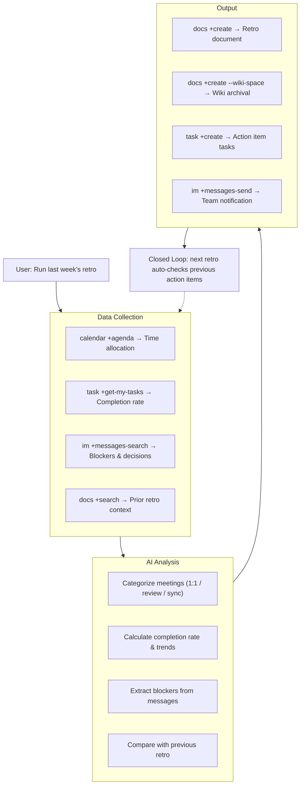

<p align="center">
  <h1 align="center">lark-retro</h1>
  <p align="center">
    <strong>AI-Driven Sprint Retrospective for Feishu/Lark</strong><br>
    One sentence triggers a complete retro cycle: data collection, analysis, structured report, knowledge archival, and action item tracking.
  </p>
  <p align="center">
    
    
    
    
  </p>
  <p align="center">
    <a href="README.md">中文文档</a>
  </p>
</p>

---

## The Problem

Sprint retrospectives are one of the most valuable team rituals — but they're often:

- **Shallow**: People forget what happened last week, so feedback is vague
- **Disconnected**: Data lives across Calendar, Messages, Tasks, and Docs — nobody synthesizes it
- **Untracked**: Action items from last retro? Already forgotten
- **Time-consuming**: 60 minutes of meeting, 10 minutes of actual insight

## The Solution

`lark-retro` turns retrospectives from a meeting into a **data-driven automated workflow**:

```
You: "帮我做一下上周的回顾"
```

The AI Agent automatically:

1. **Collects** work data from 4+ Feishu domains (Calendar, Tasks, Messages, Docs)
2. **Analyzes** patterns: time allocation, task completion rate, blockers, key decisions
3. **Generates** a structured retro report (What Went Well / What Could Be Improved / Action Items)
4. **Archives** the report as a Feishu Doc and links it to your Wiki knowledge space
5. **Creates** Tasks for each Action Item with assignees and due dates
6. **Tracks** previous Action Items — next retro automatically checks what got done

## Architecture



## What Makes This Different

| Dimension | Existing Skills | lark-retro |
|-----------|----------------|------------|
| **Scope** | Single domain (send message, check calendar) | Cross-domain orchestration (5 domains) |
| **Intelligence** | Execute commands | Analyze data, find patterns, generate insights |
| **Continuity** | One-shot operation | Closed-loop tracking across retro cycles |
| **Output** | Raw data or simple summary | Structured report + archived doc + tasks + notification |

## Capability Tiers

| Tier | Features | Authorization |
|------|----------|---------------|
| Basic | Calendar analysis + doc output | `--domain calendar,docs` |
| Enhanced | + Task tracking | `--domain calendar,task,docs` |
| Advanced | + Message search + doc search + wiki archival | + `--scope "search:message search:docs:read"` |
| Full | + Bot team notification | + Bot enabled in developer console |

Each module works independently — missing authorization for one tier simply skips that module without affecting others.

## Installation

### Prerequisites

- Node.js >= 18
- [lark-cli](https://github.com/larksuite/cli) installed and configured

### Steps

```bash
# 1. Install lark-cli (if not already installed)
npm install -g @larksuite/cli

# 2. Install official skills (includes lark-shared — MUST install before lark-retro)
npx skills add https://github.com/larksuite/cli -y -g

# 3. Install lark-retro skill
npx skills add https://github.com/gkzzhs/lark-retro -y -g

# 4. Configure and login
lark-cli config init --new

# Recommended: calendar + tasks + docs
lark-cli auth login --domain calendar,task,docs

# Optional: enable message search and doc search
lark-cli auth login --scope "search:message search:docs:read"

# 5. Restart your AI Agent tool (Trae / Cursor / Claude Code / Codex)
```

> ⚠️ Step 2 must be done before Step 3. `lark-retro` depends on the official `lark-shared` skill.
>
> ⚠️ Use `docs` (with 's'), not `doc`. The CLI rejects `doc` as an unknown domain.

## Usage Examples

### Basic Retro (Calendar + Tasks only)

```
帮我做一下上周的回顾
```

### Full Retro with Message Analysis

```
帮我复盘一下过去两周的工作，包括群聊里的关键讨论
```

### Retro with Knowledge Archival

```
生成这个 Sprint 的回顾报告，存到知识库的"团队回顾"节点下
```

### Track Previous Action Items

```
上周回顾里的行动项完成了吗？顺便做一下这周的回顾
```

### Generate Work Summary (Weekly Report)

```
帮我写这周的周报，基于日历和任务数据
```

## Sample Output

See [examples/sample-output.md](examples/sample-output.md) for a complete sample retro report.

## Configuration

First-time setup requires `lark-cli` configuration and authorization (see installation steps). For advanced setup (Wiki space, notification chat, custom tiers), see [examples/config-guide.md](examples/config-guide.md).

## Verified Capabilities

The following have been end-to-end tested with a real Feishu account:

- ✅ `calendar +agenda` — real calendar data retrieval (43 events in test)
- ✅ `task +get-my-tasks` / `task +create` — task read & creation
- ✅ `docs +create` — standalone doc / `--wiki-space my_library` / `--wiki-node` (pick one)
- ✅ `docs +search` / `im +messages-search` — doc and message search (`docs +search` results depend on title naming conventions and indexing timing; newly created docs may take a few minutes to appear)
- ✅ `im +messages-send --as bot` — bot message send & recall
- ✅ Full loop: data collection → report → doc creation → task creation → notification

## Tech Stack

- **Zero code, pure Skill**: Implemented entirely as a `SKILL.md` — no scripts, no binaries, no external dependencies
- **100% lark-cli native**: All operations use built-in `lark-cli` commands
- **Progressive enhancement**: Core features (calendar + docs) work with minimal permissions; tasks, messages, wiki, and notifications unlock incrementally

## Contributing

Contributions are welcome! Please feel free to submit issues and pull requests.

## License

[MIT](LICENSE)

---

Built with [lark-cli](https://github.com/larksuite/cli) for the Feishu CLI Creator Contest 2026.
